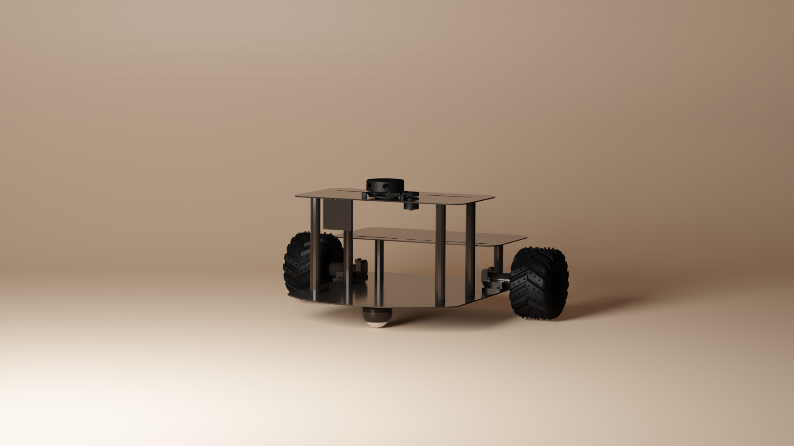

# 2D Mapping Robot Using ROS

Welcome to the 2D Mapping Robot project! This repository contains the code and documentation for a robot that performs 2D mapping using the Robot Operating System (ROS). The robot leverages a combination of sensor data and SLAM (Simultaneous Localization and Mapping) techniques to create a map of its environment.
<div allign="center">
  
</div>
---

## Table of Contents
- [Project Overview](#project-overview)
- [Features](#features)
- [Hardware Requirements](#hardware-requirements)
- [Software Requirements](#software-requirements)
- [Installation](#installation)
- [Usage](#usage)
- [Directory Structure](#directory-structure)
- [Contributing](#contributing)
- [License](#license)

---

## Project Overview

This project implements a 2D mapping robot using ROS. The robot collects data from sensors (e.g., LIDAR, IMU) and utilizes SLAM algorithms to generate a real-time 2D map of its surroundings. This can be used for applications like navigation, obstacle avoidance, and environment exploration.

---

## Features
- **Real-time Mapping:** Generates a 2D map of the environment in real time.
- **SLAM Integration:** Supports popular SLAM packages like Gmapping, Hector SLAM, or Cartographer.
- **Sensor Fusion:** Integrates data from LIDAR, IMU, and wheel encoders.
- **ROS-Compatible:** Modular design with ROS nodes for easy integration and customization.
- **Visualization:** Live map visualization using RViz.

---

## Hardware Requirements

To build and run this project, you will need:
- A mobile robot platform (e.g., custom differential drive robot).
- LIDAR sensor (e.g., RPLIDAR).
- IMU sensor.
- Optional: Wheel encoders for odometry.

---

## Software Requirements

- **ROS Distribution:** ROS Noetic (or any supported distribution).
<div allign="center">
  
</div>
- **SLAM Package:** Gmapping, Hector SLAM, or Cartographer.
- **Dependencies:**
  - `roslaunch`
  - `rviz`
  - `tf2`
  - `sensor_msgs`, `geometry_msgs`, `nav_msgs`.

---

## Installation

1. Clone this repository:
   ```bash
   git clone https://github.com/Ah2022/Ros_Mapping_Robot.git
   cd Ros_Mapping_Robot
   ```

2. Install ROS dependencies:
   ```bash
   rosdep install --from-paths src --ignore-src -r -y
   ```

3. Build the ROS workspace:
   ```bash
   catkin_make
   source devel/setup.bash
   ```

4. Install any additional SLAM packages (e.g., Gmapping):
   ```bash
   sudo apt install ros-noetic-slam-gmapping
   ```

---

## Usage

1. Launch the robot and sensors:
   ```bash
   roslaunch 2d_mapping_robot robot_bringup.launch
   ```

2. Start the SLAM algorithm:
   ```bash
   roslaunch 2d_mapping_robot slam.launch
   ```

3. Visualize the map in RViz:
   ```bash
   rosrun rviz rviz
   ```
   - Add the `Map` topic to visualize the generated map.

4. Save the generated map (optional):
   ```bash
   rosrun map_server map_saver -f ~/map
   ```

---

## Directory Structure

```
2d-mapping-robot/
├── src/
│   ├── robot_bringup/       # Launch files and robot configuration
│   ├── slam/                # SLAM-specific nodes and configurations
│   ├── sensors/             # Sensor drivers and nodes
├── maps/                    # Saved maps
├── rviz/                    # RViz configuration files
├── README.md                # Project documentation
└── CMakeLists.txt           # Build configuration
```

---

## Contributing

Contributions are welcome! Please follow these steps:
1. Fork this repository.
2. Create a new branch for your feature or bugfix:
   ```bash
   git checkout -b feature-name
   ```
3. Commit your changes and push the branch:
   ```bash
   git commit -m "Add feature description"
   git push origin feature-name
   ```
4. Create a pull request.

---

## License

This project is licensed under the MIT License. See the [LICENSE](LICENSE) file for details.

---

Feel free to reach out for any questions or suggestions. Happy mapping!
